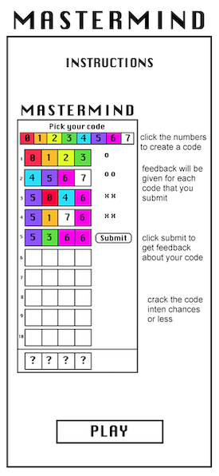
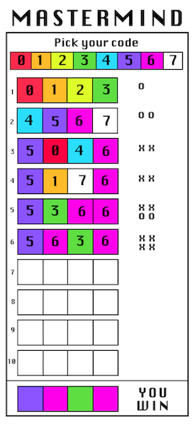

# Mastermind2.0

## Overview
Mastermind is a deductive reasoning game. The player's goal is to correctly identify the secret code (number combination). Every guess the player attempts will be followed by feedback from the computer whether the user guessed a number correctly and/or if it was in the correct position. The player's task is to analyze the feedback and deduce the secret code. Ten turns/guess attempts will be given.  
## Game Rules
* At the start of the game the computer will call upon an API to randomly select a combination of four different numbers. 
* The possible numbers are 0, 1, 2, 3, 4, 5, 6, 7. Duplicates are allowed, for example: 3389 or 7567.
* The player has ten attempts to determine the secret code.
* Each guess attempt will be given feedback with one or more of the following responses: 
    * The player has guessed __  correct number(s). 
    * The player has guessed __ correct number(s) in the correct position. 
    * The player's guess was incorrect. 
* The feedback will not directly indicate which numbers are correct.
* For example, if the secret code is 4556 and the players guesses 4357 the feedback for that guess would be: "The player has guessed 2 correct numbers in the correct position. 
* One must use logical deduction to determine the secret code. 
* A player who guesses the secret code by their tenth attempt will win!

## Live Site
https://mastermind2.netlify.app/
* pics of site 

## Installation Instructions
* make sure you have Node installed 
* To run Mastermind2.0 fork and clone this repo 
* in your terminal cd into the new directory
* to install the required dependencies:  
    >`$ npm install` 
* to run the React app: 
    >`$ npm start` 

## Technologies Used
Mastermind was built using React.js, Javascript, HTML & CSS 

To generate random numbers I used https://www.random.org/integers/ to make a call to the API: https://www.random.org/clients/http/api/.

>>"RANDOM.ORG offers true random numbers to anyone on the Internet. The randomness comes from atmospheric noise, which for many purposes is better than the pseudo-random number algorithms typically used in computer programs."

## Approach Taken
To create this app I began a Readme outlining what the app would do, an overview of the game, and the rules. I created user stores to define the functionality of the app. I defined my MVP and prioritized stretch goals. I created my react app and immediately made sure that I could access the API. The challenge with the API was that it returns a plain HTML text, not JSON. The text also includes line breaks, so I split the string, removed the extra lines and turned the strings into integers. Once I had a nice array of four numbers I was able to start building my game. I stubbed out components and began rendering them. I created a virtual game board and a virtual feedback array to hold information about the plays taken. When my components render they access their values and colors based on these virtual elements. Likewise, when guesses are clicked and when submit is fired, information gets stored in the virtual game that lives in state. I also used state to keep track of the secret code, a row count and a guess count, a win state and a lose state and the state that defines whether the welcome/instructions modal is visible. 

A major focal point of the Mastermind game is the game logic that is necessary to produce feedback about different combinations. Having duplicate numbers in the secret code created an extra challenge for the game logic. Ultimately I decided to create copies of the two arrays before I checked them against each other so that I could replace the accounted for numbers without affecting the virtual game board or feedback arrays. In this function, the game first checks once for each number in the solution, whether the guess array includes that number and if it is an exact match. Then it checks again if includes it, since it is possible to be included but not an exact match. Each time a number is included the correct feedback is incremented and stored in the virtual feedback array. 

## User Stories
#### MVP: 
* As a user I want to be able to read the instructions so I can learn how to play the game.
* As a user I want the computer to randomly generate a 4 number code so that I can try to deduce it.
* As as user I want to be able to select numbers and create a four number combination guess attempt.
* As a user I want to be able to submit my guess to check against the secret hidden combination 
* As a user I want to get feedback information about my guess so I can inform my next guess. 
    * Was one of my numbers correct? 
    * Was one of my numbers correct and in the right position? 
* As a user I want have ten chances to deduce the secret code.
* As a user I want to be able to see how many guess attempts remain.
* As user I want to see if I have won or lost

#### STRETCH GOALS: 
* As a user I want to be able to undo my guesses before I submit them.
* As a user I want to be able to forfeit and see the secret code to better understand the game.
* As a user I want to be able to make the game easier or harder for children or advanced users. 
* As a user I want to be able to track my score and play against others.

## MVP
* Detailed instructions 
* A randomly generated four number secret code (using API)
* Ability to submit a guess and receive feedback about the guess 
* Ten chances to win
* Show secret code after win/lose 

## Stretch Goals
- Make site fully responsive & accessible
- Add colors to number elements (Red, Orange, Yellow, Green, Blue, Indigo, Violet and White)
- Change feedback responses to colored element 
    * red pegs signify right number and right position
    * white pegs signify just right number 
    * For example, if the secret code is 4556 and the players guesses 5357 the feedback for that guess would be one red peg and one white peg
- Add undo option to remove guesses within that turn
- Add more levels, easier (less numbers no duplicates) and harder (more numbers)
- Add ability to see code before game is over (automatic loss/forfeit)
- Add animations
- Ability to keep score (two player game) 
- Add a turn timer

## Wireframes

## Sprints
Wed: 
* create react app 
* add Readme with details
* get feedback about previous version of the game 
* review React

Thurs:
* hit API
* make wireframes and conceptualize components 
* update sprints 

Fri:
* create game components 
* update sprints 

Sat: 
* add event handlers
* add state variables

Sun: 
* GAME LOGIC 🍦🍦🍦

Mon:
* add welcome & instructions
* style game 
* add API info to Readme
* work on Readme more 

